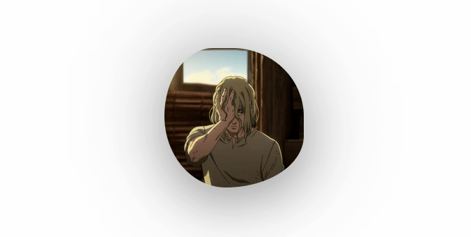
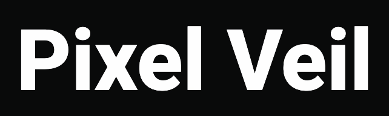

<h1 align=center><samp>Animations</samp></h1>

My journal of animations I liked, built, or felt inspired to recreate. Small motion experiments influenced by things I’ve seen, explored, or wanted to try. A casual place to collect ideas without a specific use case.

---

### 1. Typing Reveal

I don’t remember where I first saw this animation, but I liked it enough to recreate it back in 2021 on my first web development company’s landing page. I copied it from my old repo, so this is exactly how it looked back then.

    

### 2. Photo Bubble

I found this effect in a YouTube video where someone was reviewing front-end developer portfolios. Back then, I was browsing the web to see what a front-end portfolio should include, and this animation caught my eye. Unfortunately, the developer’s site changed and the effect was gone, so I decided to recreate it in my own style.

    

### 3. Pixel Veil

While browsing projects on GitHub, I opened one that was still building on render.com, so I had to wait. On the right side, there was a grid of empty squares that revealed pixel-like artwork on hover, and it immediately caught my attention. At first, I had a completely different idea for this animation - it was supposed to wrap around the page and cover only part of the text, but I didn’t like how it felt. The animation itself was interesting enough that I kept trying to reuse it in different ways, with one idea leading to another. I kept working on it from the afternoon until late at night, until it evolved into its current form.

Hmmm… did I just admit to my procrastination?

    

